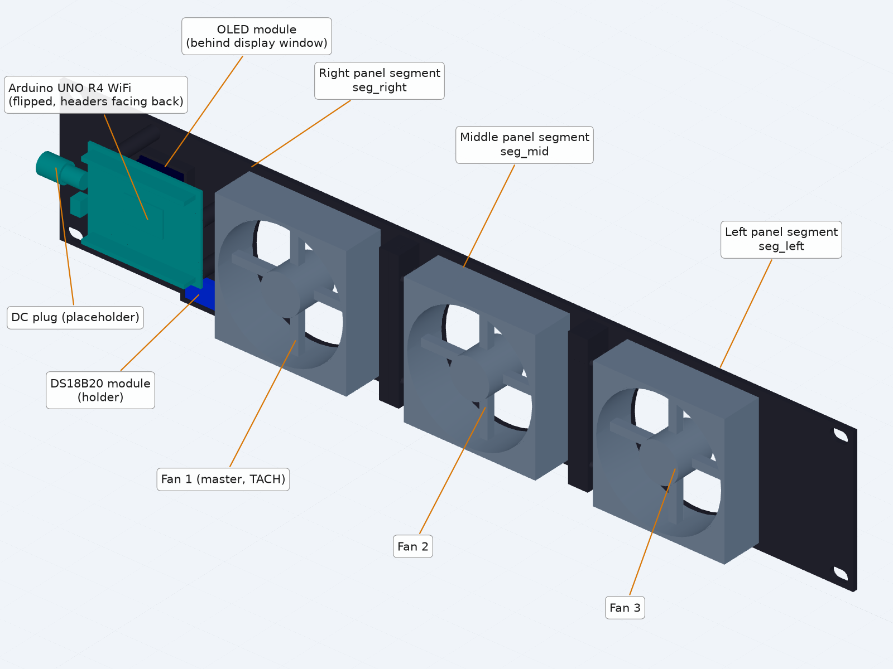
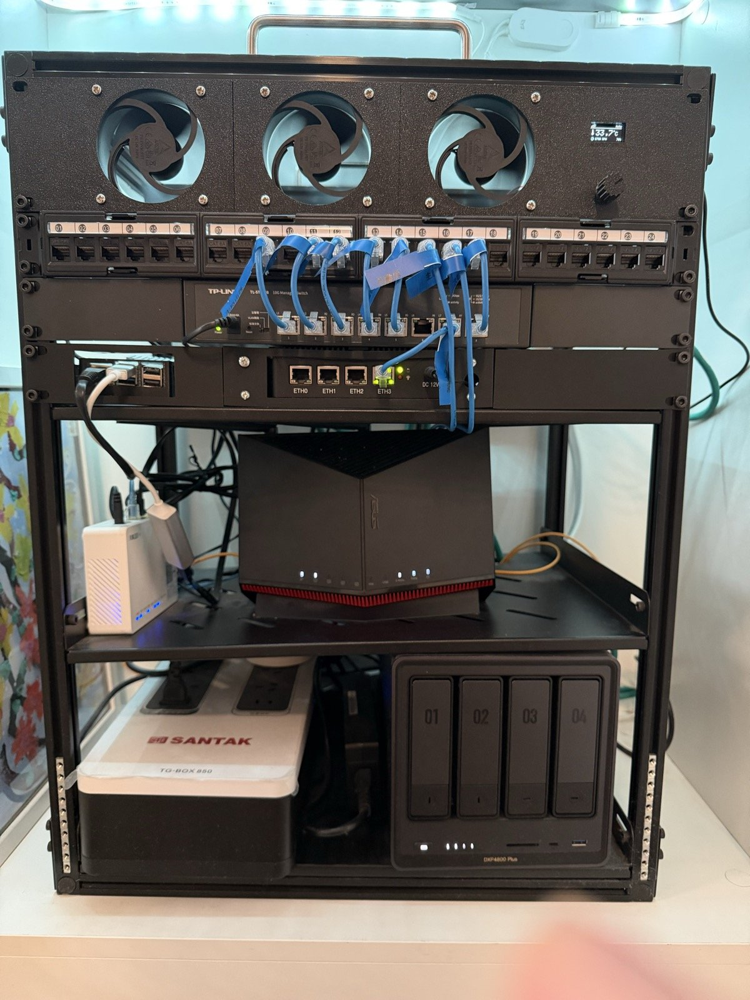
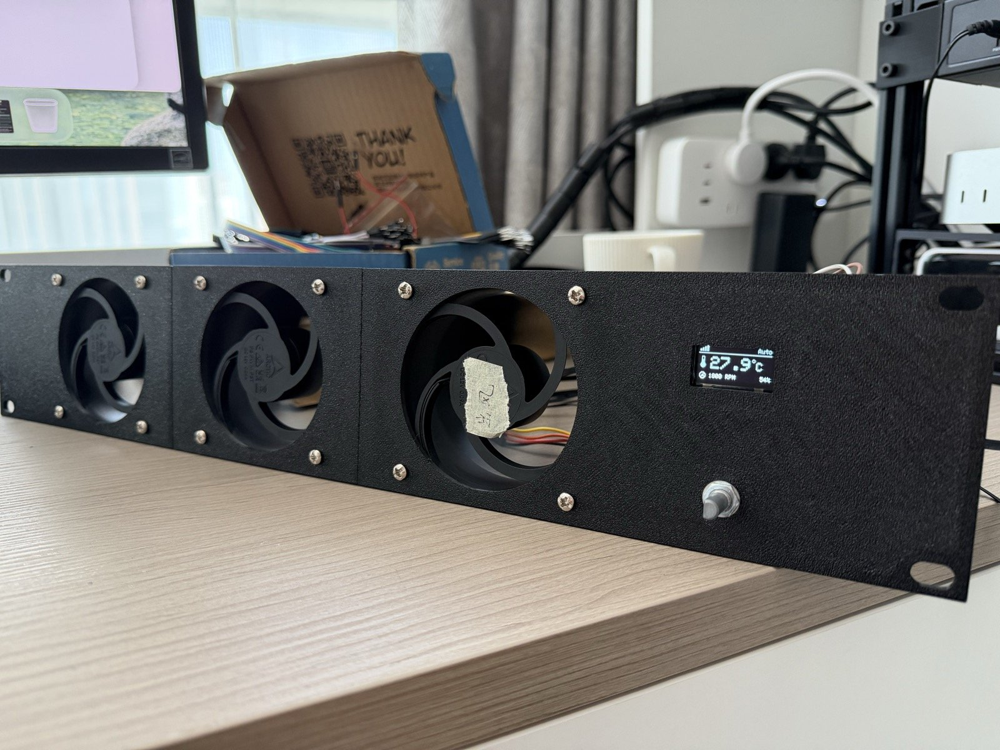
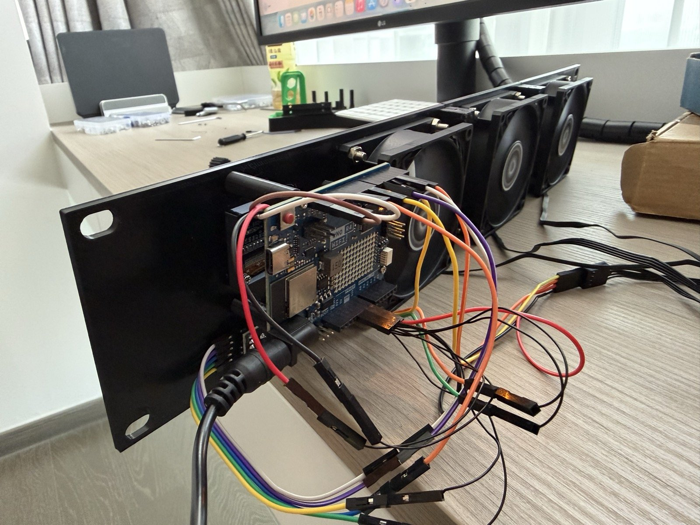
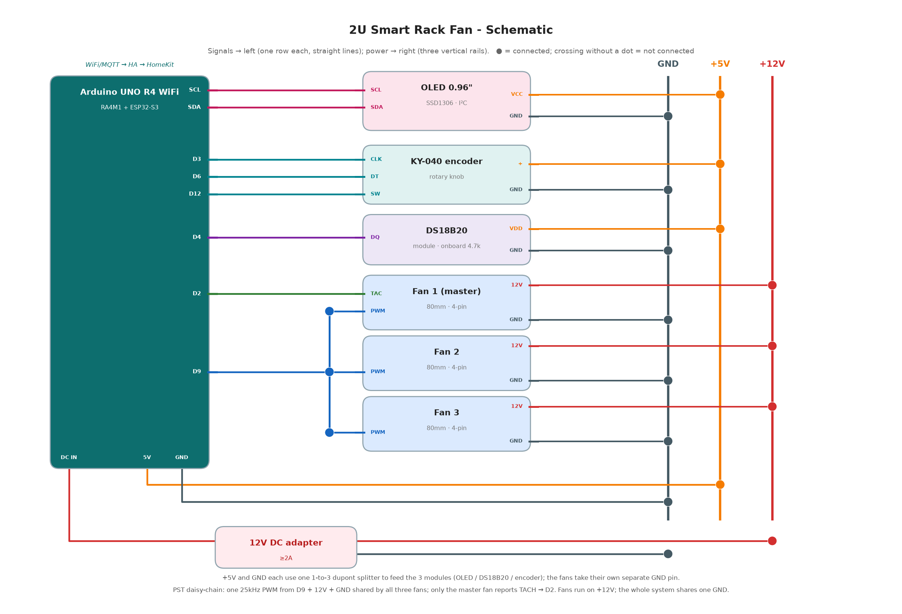
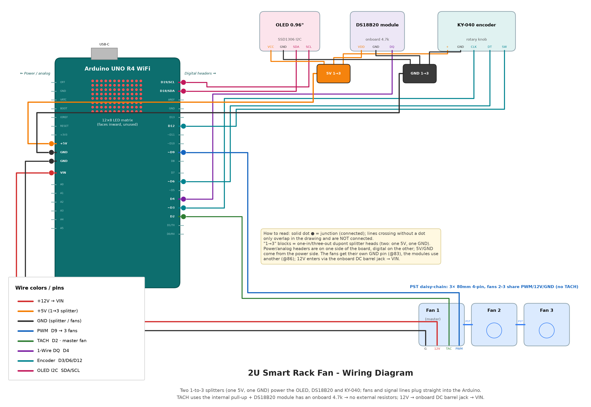
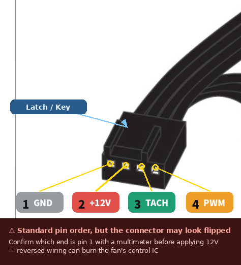
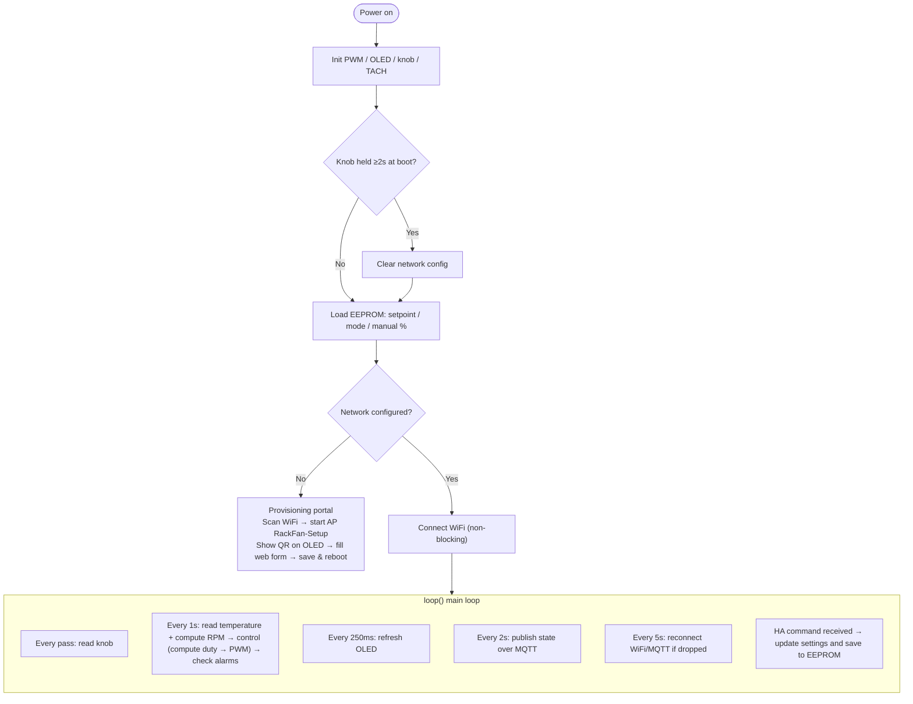
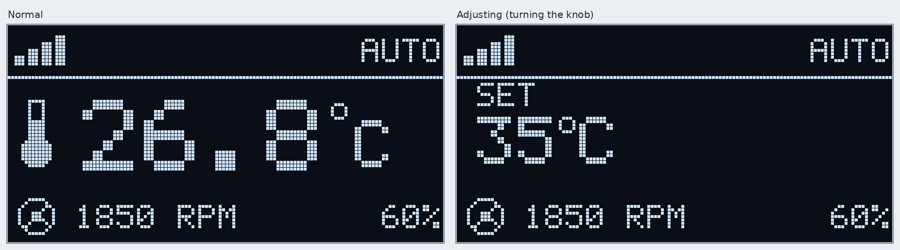
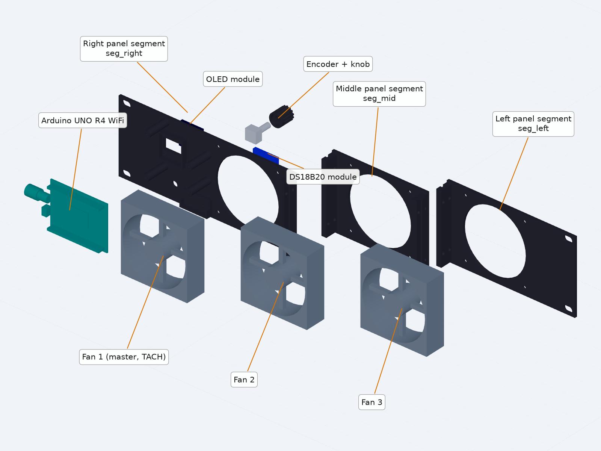

# 19" 2U Smart Temperature-Controlled Rack Fan (DIY)

**English** | [简体中文](README.zh-CN.md)

A 19-inch 2U rack-mount fan panel for network/server cabinets: three 80mm PWM fans automatically adjust their speed based on the temperature inside the cabinet. **The temperature control loop runs on the Arduino, so cooling keeps working even when the network is down.** A front-panel OLED + rotary knob provide local control, and WiFi/MQTT connects it to Home Assistant, which can in turn bridge it to Apple HomeKit. The panel is 3D printed, and every module connects **directly to the Arduino** with dupont wires (no soldering, no resistors).



### Photos

<p align="center">
  
  
</p>
<p align="center"><i>Left: installed at the top of a home network cabinet. Right: front panel — OLED shows temperature, mode, master fan RPM and duty.</i></p>

<p align="center">
  
</p>
<p align="center"><i>Rear: the Arduino is mounted flipped so every module plugs straight into its headers with dupont wires (no breadboard, no soldering).</i></p>

---

## 1. Bill of Materials

### 1.1 Electronics

| Part | Spec | Qty | Approx. price (US) | Link (US) |
|---|---|---|---|---|
| Arduino UNO R4 WiFi | Must be the **WiFi** version (ABX00087) | 1 | $27.50 | [Amazon](https://www.amazon.com/Arduino-UNO-WiFi-ABX00087-Bluetooth/dp/B0C8V88Z9D) |
| Arctic P8 PWM PST fan | 8025, 4-pin PWM, 0.14A, stops at 0% PWM (**not** the "CO" variant) | 3 | ~$9 each | [Amazon](https://www.amazon.com/ARCTIC-P8-PWM-PST-Pressure-optimised/dp/B07WWKF96F) |
| 4-pin male-to-female fan extension cable | 2.54mm, ~300mm / 12" (master fan → Arduino headers) | 1 | ~$8 (2-pack) | [Amazon](https://www.amazon.com/Cable-Matters-2-Pack-4-Pin-Extension/dp/B07FK5H679) |
| 12V DC power adapter | 12V 2A, 5.5×2.1mm, center positive | 1 | ~$9 | [Amazon](https://www.amazon.com/Power-Supply-5-5x2-1mm-Plug-White/dp/B09J267K2P) |
| DS18B20 temperature module | Onboard 4.7k pull-up | 1 | ~$7 (3-pack) | [Amazon](https://www.amazon.com/DS18B20-Temperature-Measurement-Arduino-Starter/dp/B0786CZCYJ) |
| 0.96" OLED | SSD1306, 128×64, 4-pin I2C | 1 | ~$7 | [Amazon](https://www.amazon.com/HiLetgo-Adafruit-Beaglebones-Raspberry-Optional/dp/B076DYCWC8) |
| KY-040 rotary encoder | Threaded bushing + nut + push button | 1 | ~$9 (8-pack) | [Amazon](https://www.amazon.com/WGCD-KY-040-Degree-Encoder-Arduino/dp/B07B68H6R8) |
| **1-to-3 dupont splitter cable** | 2.54mm, one male end → three female ends; one for 5V, one for GND | 2 | ~$7 (pack) | [Amazon search](https://www.amazon.com/s?k=dupont+jumper+wire+splitter+1+male+to+3+female) |
| Dupont wires | 20cm, M-F / M-M / F-F assortment, for signals | several | ~$7 (120 pcs) | [Amazon](https://www.amazon.com/Elegoo-EL-CP-004-Multicolored-Breadboard-arduino/dp/B01EV70C78) |

> Total ≈ US$110 (Amazon prices vary; most small parts only come in multi-packs). Three fans at full speed draw about 0.4A @ 12V and the whole unit ~0.7A, so a 12V 2A adapter is plenty. The links are examples — any part matching the spec column works. Buying in China? [README.zh-CN.md](README.zh-CN.md) lists Taobao links.
>
> ⚠ The printed mounts were sized on the original (Taobao) modules: DS18B20 PCB 28.2×13mm, OLED M2 holes 21×21.5mm apart, encoder bushing Ø6.8mm. Module footprints vary between sellers — check yours, and adjust `SENS_*`/`MOD_*`, `OLED_HOLE_*` and `ENC_HOLE_D` in `cad/rack_fan_2u.py` if needed (see `cad/README.md`).

### 1.2 Printed parts (PETG, Bambu P1S)

The 482.6mm panel is wider than the 256mm print bed, so it is split into 3 segments joined with M3 screws. STLs are in `cad/stl/`.

| Part | Contents | Orientation |
|---|---|---|
| `seg_left.stl` (155mm) | Fan 3 + left rack ear | Front face down |
| `seg_mid.stl` (117mm) | Fan 2 | Front face down |
| `seg_right.stl` (215mm) | Fan 1 (master) + control area (OLED window, knob hole, Arduino standoffs, DS18B20 holder) + right rack ear | Front face down |
| `encoder_knob.stl` | Knob (D-shaped bore, press-fits a 6mm shaft) | Top face down |

Print settings: 0.2mm layers / 4 walls / 30–40% gyroid, essentially no supports. PLA softens with heat — use PETG.

### 1.3 Fasteners

| Use | Spec | Qty |
|---|---|---|
| Joining segments | M3×16 + nut | 8 |
| Fans → panel | M4 | 12 |
| Arduino → standoffs | M2×8 self-tapping | 4 |
| OLED → standoffs | M2×6 self-tapping | 4 |
| DS18B20 → holder | M2.5×6 self-tapping | 1 |
| Encoder | Nut supplied with the module | 1 |
| Rack mounting | M6 cage nuts + screws | 4 |
| Cable strain relief | Zip ties | several |

---

## 2. Schematic



> Signal lines run left to the Arduino; power lines run right to the three power rails (GND / +5V / +12V). ● = connected; a crossing without a dot = not connected.

**Pin assignment (UNO R4 WiFi)**

| Function | Pin | Notes |
|---|---|---|
| Fan PWM | **D9** | 25kHz (core `PwmOut`), drives all 3 fans through the PST daisy chain |
| Fan TACH | **D2** | Master fan only; `INPUT_PULLUP`, interrupt-counted (2 pulses/rev) |
| DS18B20 | **D4** | 1-Wire, module has an onboard 4.7k pull-up |
| OLED | **SDA / SCL** | I2C, address 0x3C |
| KY-040 | **D3 / D6 / D12** | CLK / DT / SW, internal pull-ups; **CLK must be on D3** (on the R4 only D2/D3 support external interrupts, and D2 is taken by TACH) |
| Fan +12V | **VIN** | 12V enters through the onboard DC barrel jack and is taken straight from VIN |

---

## 3. Wiring

**Two 1-to-3 dupont splitters distribute power; everything else plugs straight into the Arduino headers.**



> Colors: red = +12V, orange = +5V, black = GND, blue = PWM, green = TACH, purple = 1-Wire, cyan = encoder, pink = I2C. The two small squares are the 5V / GND 1-to-3 splitters.

### 3.1 Connection table

| Arduino | Connects to | Wire |
|---|---|---|
| DC barrel jack | 12V adapter | — |
| **5V** | OLED VCC / DS18B20 VDD / KY-040 + | 1-to-3 splitter #1 |
| **GND** (pin ②) | OLED GND / DS18B20 GND / KY-040 GND | 1-to-3 splitter #2 |
| **VIN** | Master fan pin 2 (+12V) | 4-pin adapter cable |
| **GND** (pin ①) | Master fan pin 1 (GND) | 4-pin adapter cable |
| **D9** | Master fan pin 4 (PWM) | 4-pin adapter cable |
| **D2** | Master fan pin 3 (TACH) | 4-pin adapter cable |
| **SDA / SCL** | OLED SDA / SCL | Dupont wire |
| **D4** | DS18B20 DQ | Dupont wire |
| **D3 / D6 / D12** | KY-040 CLK / DT / SW | Dupont wire (swap CLK/DT if the rotation direction is reversed) |

- **PST daisy chain**: Fan 1 (master) → Fan 2 → Fan 3, chained through the male/female 4-pin connectors built into the fans. GND / +12V / PWM are shared along the chain; the two downstream fans don't report TACH, so only the master fan's speed can be measured.
- The fan ground and the module ground each use their own GND pin; they are common on the board.

### 3.2 4-pin fan connector pinout



| Pin | Signal | Connects to |
|---|---|---|
| 1 | GND | GND |
| 2 | +12V | VIN |
| 3 | TACH | D2 |
| 4 | PWM | D9 |

> ⚠ Locate pin 1 using the locking tab and confirm with a multimeter before powering up — plugging it in reversed can destroy the fan.

### 3.3 Pre-power-on checklist

- [ ] No short between VIN/GND or 5V/GND; the master fan's 4-pin cable is not reversed.
- [ ] All 3 leads of the 5V splitter go to module positive pins; all 3 leads of the GND splitter go to module grounds.
- [ ] First connect only the master fan and verify speed control and RPM reading, then chain on the other two.

---

## 4. Software Overview

Firmware: `firmware/smartfan/smartfan.ino` (single file, non-blocking main loop).



> **Networking is an add-on**: if WiFi/MQTT/HA goes down, only reporting and remote control are affected — temperature sampling and fan control keep running.

### 4.1 Control algorithm

**Fan curve** (shifts with the setpoint Tset, default 35°C):

- `T ≤ Tset−10°C` → 20%; `T ≥ Tset+6°C` → 100%; linear in between
- With defaults: 25°C→20%, 30°C→45%, 35°C→70%, ≥41°C→100%
- Duty changes by at most 5% per second to avoid abrupt jumps

**Four modes**

| Mode | Duty |
|---|---|
| Auto | Follows the curve |
| Silent | Follows the curve, capped at 60% |
| Manual | Fixed manual value |
| Turbo | 100% |

**Safety (takes priority over the mode)**

- Sensor unreadable / out of range, or temperature ≥ 60°C → forced 100% + alarm
- Duty >25% but master fan <60 RPM → stall alarm
- Power off (turned off from HA) → 0%, fans stop
- On alarm the whole OLED screen blinks

### 4.2 Knob and display

| Action | Effect |
|---|---|
| Rotate | Adjust setpoint (±1°C, 25–55); in Manual mode, adjust fan % (±5) |
| Short press | Cycle the edited item: temperature → fan % → mode |
| Long press (≥0.8s) | Change mode: Auto → Manual → Silent → Turbo |
| Hold 2s at power-on | Re-run WiFi provisioning |

OLED: top bar shows WiFi signal + mode, the middle shows the temperature in large digits, the bottom shows master fan RPM + duty. While turning the knob, the middle temporarily shows the value being adjusted.



Setpoint, mode and manual % are stored in EEPROM (survive power loss) and sync both ways with HA.

### 4.3 WiFi provisioning

1. On first boot (or when holding the knob for 2s at power-on), the OLED shows a QR code.
2. Scan it with your phone to join the `RackFan-Setup` hotspot (password `configme123`). The setup page usually pops up automatically; if not, open `192.168.4.1`.
3. Pick your WiFi from the list (**2.4GHz only**) and enter its password, then the MQTT host/port/credentials and device ID (default `rackfan01`) → save, and the device reboots automatically.

Temperature control keeps running while the setup portal is open (the OLED just shows the QR code instead of the status screen).

> The setup hotspot password is a public default. It only matters while the portal is open, but anyone nearby could join during that window — change `AP_PASS` at the top of the `.ino` before flashing if that concerns you. WiFi/MQTT credentials are stored in the board's EEPROM, and MQTT runs unencrypted on port 1883, so keep the broker on a trusted LAN.

### 4.4 Home Assistant / HomeKit

1. In HA, install the **Mosquitto broker** and create an MQTT user (enter this user during provisioning), then add the **MQTT** integration (leave the discovery prefix as `homeassistant`).
2. Once the device is online, **Smart Rack Fan** appears automatically with: `climate` (thermostat + mode presets), `fan` (on/off + speed), `sensor` (temperature, RPM), `binary_sensor` (alarm).
3. Add the **HomeKit Bridge** integration and include the `climate` entity → pair it in the Apple Home app by scanning the code, and you can control it with Siri.

MQTT topics are `rackfan/<device ID>/<item>/state` (reports) and `.../<item>/set` (commands). Report-only items: `temp`, `rpm`, `action`, `alarm`; controllable items: `power`, `hvac/mode` (cool/off), `set` (target temperature 25–55), `mode` (Auto/Manual/Silent/Turbo), `pct` (manual %). For debugging, subscribe to `rackfan/rackfan01/#`. If you'd rather not use auto-discovery, configure it manually with `homeassistant/rack_fan.yaml`.

---

## 5. Assembly



1. **Join the panel**: slot the three segments together by their tongue-and-groove joints; 4 × M3×16 + nuts per seam.
2. **Mount the fans**: fans go behind the panel, fixed with M4 screws. This unit **exhausts air out of the cabinet**: the airflow arrow points forward (toward the panel), so the cabinet needs a cool-air intake elsewhere.
3. **Mount the OLED**: align the glass with the display window and screw it onto the four corner standoffs with 4 × M2×6 self-tapping screws, pins facing backward.
4. **Mount the Arduino**: 4 × M2×8 self-tapping screws into the standoffs. ⚠ **Component side / headers face backward** (so dupont wires fit), and **USB/DC ports face right** (toward the rack ear, so the 12V plug has room).
5. **Mount the encoder + DS18B20**: pass the encoder bushing through the panel hole, tighten with its nut, then press on the knob; slide the DS18B20 into its holder and fix it with 1 × M2.5 self-tapping screw.
6. **Wire it up**: follow Section 3; secure the adapter cable, splitters and power lead with zip ties.
7. **Rack it**: M6 screws through the oval slots on both sides. Plug in 12V and provision as in 4.3.

---

## 6. Flashing and Development

- **Flashing**: in the Arduino IDE install the `Arduino UNO R4 Boards` core, then the libraries `ArduinoMqttClient`, `ArduinoJson` (v6 or v7), `OneWire`, `DallasTemperature`, `Adafruit GFX Library`, `Adafruit SSD1306`, `QRCode` (Richard Moore). Close the Serial Monitor before uploading.
- Tunables at the top of the `.ino`: `DEBUG_NO_HW` must be 0 (1 = simulated temperature, for bench testing only); `USE_PWMOUT_25K` = 1 outputs 25kHz, 0 falls back to analogWrite (~490Hz, audible whine); `OLED_ADDR`; control parameters; `AP_PASS`.
- **Bring-up order**: provisioning → master fan speed control/RPM → chain all 3 fans → unplug the DS18B20 to verify forced 100% → knob/OLED → disconnect the network to verify it still follows the curve.
- **CAD**: `cad/rack_fan_2u.py` is the single source of parameters; see [cad/README.md](cad/README.md) for the parameter reference and build commands.
- **Regenerating images**: `python3 tools/gen_schematic.py` (schematic), `gen_breadboard.py` (wiring diagram), `gen_oled_preview.py` (OLED preview). Requires `matplotlib` and `Pillow`.

```
.
├── README.md                  This document
├── firmware/smartfan/         Firmware
├── homeassistant/             Manual HA YAML (fallback)
├── photos/                    Photos of the finished build
├── cad/                       Parametric CAD + STEP; stl/ holds the printable parts
└── tools/                     Scripts and images for the schematic / wiring diagram / OLED preview
```

## License

[MIT](LICENSE) — covers the firmware, scripts, CAD sources and printable models. Build and use at your own risk.
