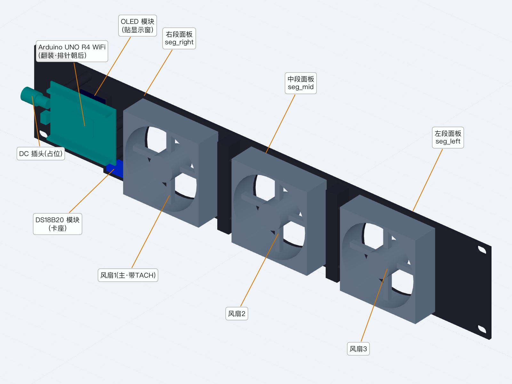
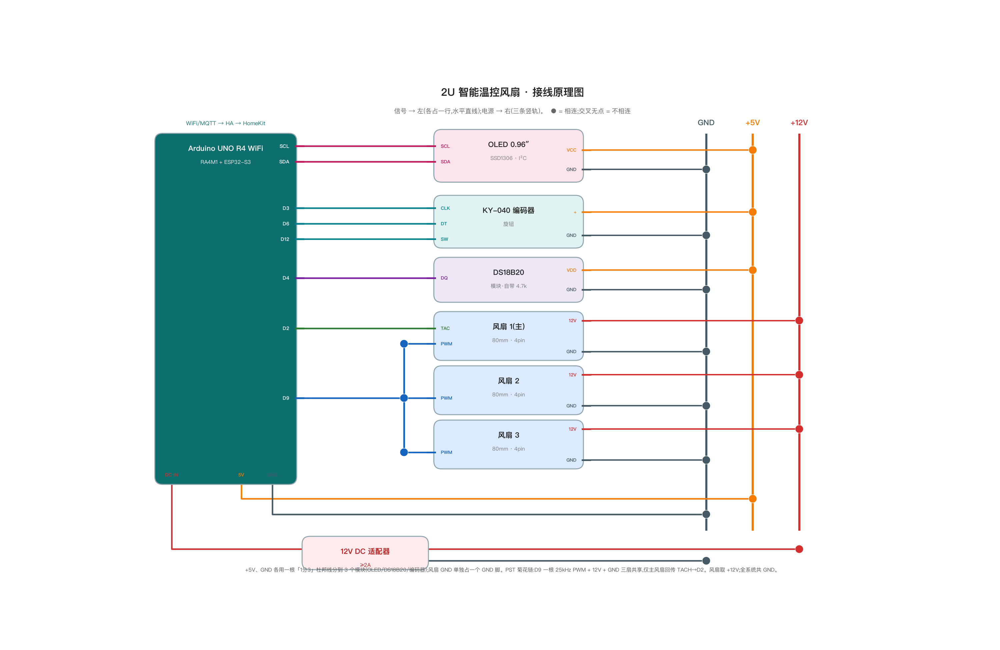
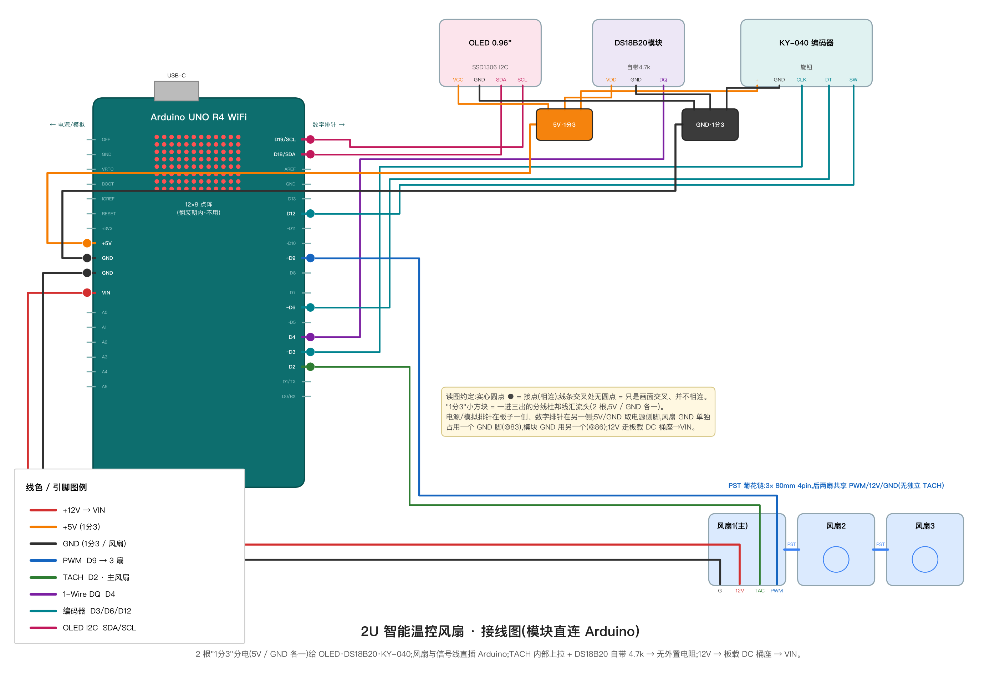
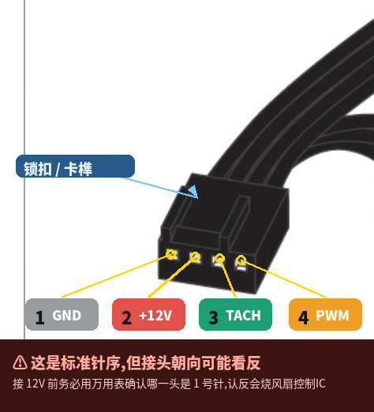
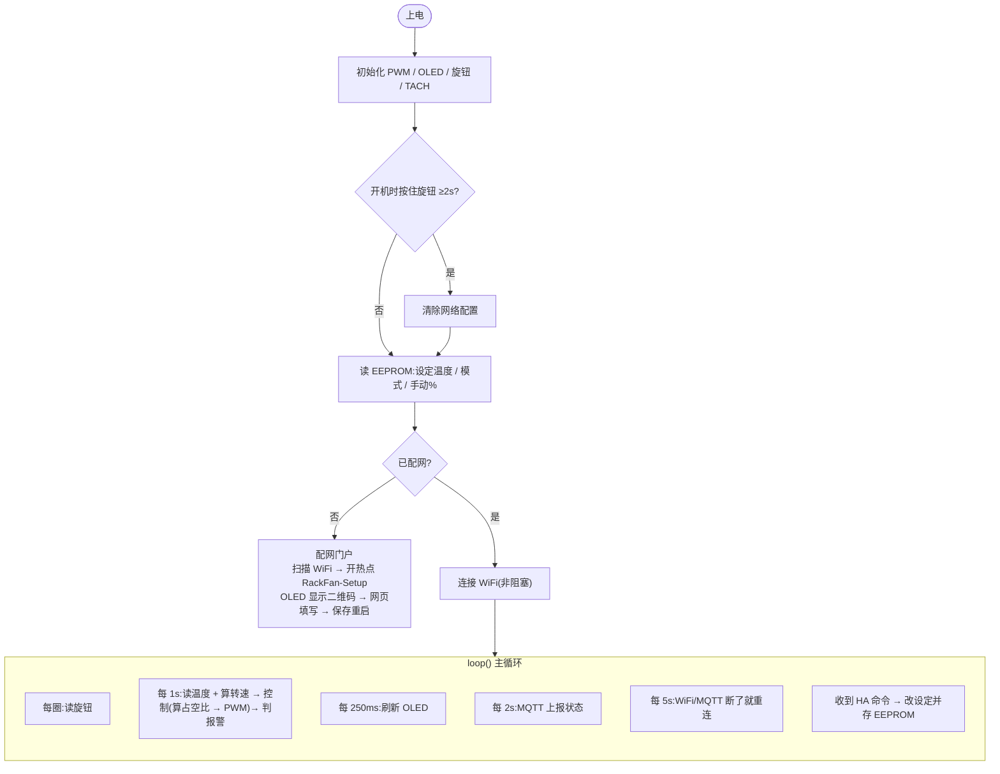
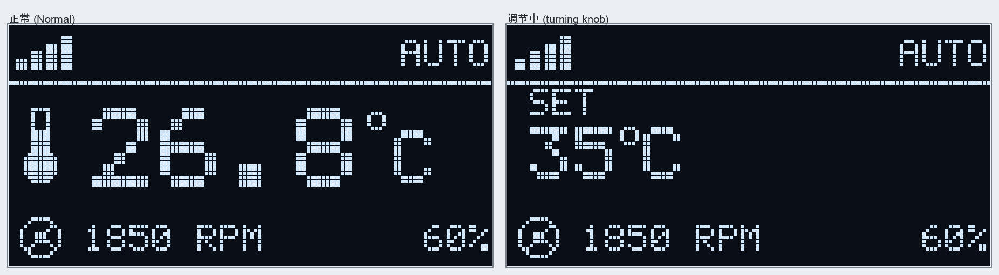
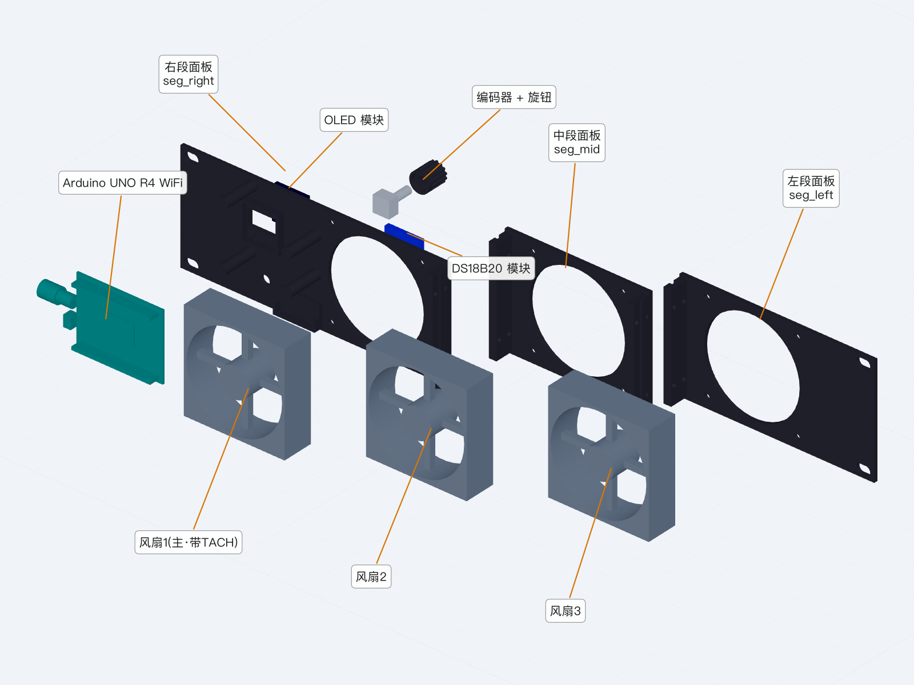

# 19" 2U 智能温控风扇(DIY)

[English](README.md) | **简体中文**

机柜用 19 英寸 2U 机架式温控风扇:3 个 80mm PWM 风扇按柜内温度自动调速,**温控闭环跑在 Arduino 上,断网照常散热**;前面板 OLED + 旋钮本地操作,WiFi/MQTT 接入 Home Assistant,再桥接 Apple HomeKit。面板 3D 打印,所有模块用杜邦线**直连 Arduino**(免焊、无电阻)。



### 实拍照片

<p align="center">
  
  
</p>
<p align="center"><i>左:装在家用网络机柜顶部。右:前面板,OLED 显示温度、模式、主风扇转速和占空比。</i></p>

<p align="center">
  
</p>
<p align="center"><i>背面:Arduino 翻装,各模块用杜邦线直插排针(无面包板、免焊)。</i></p>

---

## 一、硬件清单

### 1.1 电子元件

| 元件 | 规格 | 数量 | 单价 | 购买链接(淘宝) |
|---|---|---|---|---|
| Arduino UNO R4 WiFi | 需 **WiFi** 版 | 1 | ¥78 | [链接](https://item.taobao.com/item.htm?id=728466241901&skuId=5362929322720) |
| Arctic P8 PWM PST 风扇 | 8025,4pin PWM,0.14A,0% PWM 停转 | 3 | ¥53.1 | [链接](https://item.taobao.com/item.htm?id=746236890766) |
| 4P 公对母转接线 | 2.54,300mm(主风扇 → Arduino 排针) | 1 | ¥0.95 | [链接](https://item.taobao.com/item.htm?id=595308472628) |
| 12V DC 适配器 | 12V 2A,5.5×2.1,中心正极 | 1 | ¥4.6 | [链接](https://item.taobao.com/item.htm?id=801362523945&skuId=5629734151517) |
| DS18B20 温度模块 | 自带 4.7k 上拉 | 1 | ¥3.27 | [链接](https://item.taobao.com/item.htm?id=868763780725) |
| 0.96" OLED | SSD1306,128×64,I2C 4 针 | 1 | ¥12.78 | [链接](https://item.taobao.com/item.htm?id=902239028745) |
| KY-040 旋转编码器 | 带螺纹套筒 + 按压 | 1 | ¥0.5 | [链接](https://item.taobao.com/item.htm?id=828378519209) |
| **「1分3」杜邦线** | 5V、GND 各一根 | 2 | ¥2.99 | [链接](https://item.taobao.com/item.htm?id=943150762066&skuId=5844444132189) |
| 杜邦线 | 20cm,信号线 | 若干 | ¥1.19 | [链接](https://item.taobao.com/item.htm?id=932664239195) |

> 合计约 ¥270。3 风扇满速约 0.4A@12V,整机 ~0.7A,12V 2A 适配器足够。

### 1.2 打印件(PETG,Bambu P1S)

482.6mm 面板超出 256mm 打印床,切成 3 段用 M3 连接。STL 在 `cad/stl/`。

| 件 | 内容 | 摆放 |
|---|---|---|
| `seg_left.stl`(155mm) | 风扇3 + 左机架耳 | 正面朝下 |
| `seg_mid.stl`(117mm) | 风扇2 | 正面朝下 |
| `seg_right.stl`(215mm) | 风扇1(主)+ 控制区(OLED 窗、旋钮孔、Arduino 立柱、DS18B20 卡座)+ 右机架耳 | 正面朝下 |
| `encoder_knob.stl` | 旋钮(D 形孔压 6mm 轴) | 顶面朝下 |

打印参数:0.2mm 层高 / 4 圈墙 / 30–40% gyroid,基本免支撑。PLA 会热软化,用 PETG。

### 1.3 紧固件

| 用途 | 规格 | 数量 |
|---|---|---|
| 段间连接 | M3×16 + 螺母 | 8 |
| 风扇 → 面板 | M4 | 12 |
| Arduino → 立柱 | M2×8 自攻 | 4 |
| OLED → 立柱 | M2×6 自攻 | 4 |
| DS18B20 → 卡座 | M2.5×6 自攻 | 1 |
| 编码器 | 模块自带螺母 | 1 |
| 上机架 | M6 笼母 + 螺丝 | 4 |
| 走线应力释放 | 扎带 | 若干 |

---

## 二、原理图



> 信号线向左到 Arduino,电源线向右到三条电源轨(GND / +5V / +12V)。●=相连,交叉无圆点=不相连。

**引脚分配(UNO R4 WiFi)**

| 功能 | 引脚 | 说明 |
|---|---|---|
| 风扇 PWM | **D9** | 25kHz(核心 `PwmOut`),经 PST 菊花链给 3 个风扇 |
| 风扇 TACH | **D2** | 仅主风扇回传,`INPUT_PULLUP` 中断计数(2 脉冲/转) |
| DS18B20 | **D4** | 1-Wire,模块自带 4.7k |
| OLED | **SDA / SCL** | I2C,地址 0x3C |
| KY-040 | **D3 / D6 / D12** | CLK / DT / SW,内部上拉;**CLK 必须 D3**(R4 只有 D2/D3 能外部中断,D2 已给 TACH) |
| 风扇 +12V | **VIN** | 12V 从板载 DC 母座进,VIN 直接取 |

---

## 三、接线方式

**2 根「1分3」杜邦线分电 + 其余全部直插 Arduino 排针。**



> 颜色:红=+12V、橙=+5V、黑=GND、蓝=PWM、绿=TACH、紫=1-Wire、青=编码器、粉=I2C。两个小方块即 5V / GND「1分3」。

### 3.1 逐线连接表

| Arduino | 接到 | 线 |
|---|---|---|
| DC 母座 | 12V 适配器 | — |
| **5V** | OLED VCC / DS18B20 VDD / KY-040 + | 「1分3」#1 |
| **GND**(脚②) | OLED GND / DS18B20 GND / KY-040 GND | 「1分3」#2 |
| **VIN** | 主风扇 pin2(+12V) | 4P 转接线 |
| **GND**(脚①) | 主风扇 pin1(GND) | 4P 转接线 |
| **D9** | 主风扇 pin4(PWM) | 4P 转接线 |
| **D2** | 主风扇 pin3(TACH) | 4P 转接线 |
| **SDA / SCL** | OLED SDA / SCL | 杜邦线 |
| **D4** | DS18B20 DQ | 杜邦线 |
| **D3 / D6 / D12** | KY-040 CLK / DT / SW | 杜邦线(旋转方向反了就对调 CLK/DT) |

- **PST 菊花链**:风扇1(主)→ 风扇2 → 风扇3,用风扇自带的公母 4pin 头逐个串接。链上 GND / +12V / PWM 共享,后两扇 TACH 不回传,所以只能测主风扇转速。
- 风扇地和模块地各占一个 GND 脚,板内共地。

### 3.2 4pin 风扇针序



| 针 | 信号 | 接到 |
|---|---|---|
| 1 | GND | GND |
| 2 | +12V | VIN |
| 3 | TACH | D2 |
| 4 | PWM | D9 |

> ⚠ 以锁扣定位 1 号针,上电前用万用表确认,插反会烧风扇。

### 3.3 上电前检查

- [ ] VIN/GND、5V/GND 不短路;主风扇 4P 线没插反。
- [ ] 5V「1分3」的 3 个头都在模块正极,GND「1分3」的 3 个头都在模块地。
- [ ] 先只接主风扇验证调速和转速,再串上后两扇。

---

## 四、软件整体流程

固件:`firmware/smartfan/smartfan.ino`(单文件,非阻塞主循环)。



> **网络只是附加功能**:WiFi/MQTT/HA 掉线只影响上报和远程控制,温度采样与风扇控制照常运行。

### 4.1 温控算法

**风扇曲线**(随设定温度 Tset 平移,默认 35°C):

- `T ≤ Tset−10°C` → 20%;`T ≥ Tset+6°C` → 100%;中间线性
- 默认值下:25°C→20%、30°C→45%、35°C→70%、≥41°C→100%
- 占空比每秒最多变 5%,避免突变

**四种模式**

| 模式 | 占空比 |
|---|---|
| Auto | 跟曲线 |
| Silent | 跟曲线,封顶 60% |
| Manual | 固定手动值 |
| Turbo | 100% |

**安全保护(优先级高于模式)**

- 传感器读不到 / 超量程,或温度 ≥ 60°C → 强制 100% + 报警
- 占空比 >25% 但主风扇转速 <60 RPM → 堵转报警
- 关机(HA 关闭)→ 0%,风扇停转
- 报警时 OLED 整屏闪烁

### 4.2 旋钮与显示

| 操作 | 作用 |
|---|---|
| 转 | 调设定温度(±1°C,25–55);Manual 模式下调风扇 %(±5) |
| 短按 | 切换被调项:温度 → 风扇% → 模式 |
| 长按(≥0.8s) | 切模式:Auto → Manual → Silent → Turbo |
| 开机按住 2s | 重新配网 |

OLED:顶栏 WiFi 信号 + 模式,中间大号温度,底部主风扇转速 + 占空比;转旋钮时中间临时显示正在调的值。



设定温度、模式、手动% 存 EEPROM,断电不丢,并与 HA 双向同步。

### 4.3 配网

1. 首次上电(或开机按住旋钮 2s),OLED 显示二维码。
2. 手机扫码连上热点 `RackFan-Setup`(密码 `configme123`),配置页一般会自动弹出;没弹就打开 `192.168.4.1`。
3. 从列表选 WiFi(**只支持 2.4GHz**)并填密码,再填 MQTT 地址/端口/账号和设备 ID(默认 `rackfan01`)→ 保存后自动重启。

配网门户开着期间温控照常运行(OLED 显示二维码而不是状态页)。

> 配网热点密码是公开的默认值。它只在配网门户开启期间有效,但这段时间附近任何人都能连上——介意的话,烧录前改掉 `.ino` 顶部的 `AP_PASS`。WiFi/MQTT 账号密码存在板子 EEPROM 里,MQTT 走 1883 明文,broker 请放在可信局域网内。

### 4.4 接入 Home Assistant / HomeKit

1. HA 安装 **Mosquitto broker** 并建一个 MQTT 账号(配网时填这个账号),再添加 **MQTT** 集成(发现前缀保持 `homeassistant`)。
2. 设备上线后自动出现 **Smart Rack Fan**:`climate`(温控器 + 模式预设)、`fan`(开关 + 调速)、`sensor`(温度、转速)、`binary_sensor`(报警)。
3. 添加 **HomeKit Bridge** 集成,勾选 `climate` 实体 → 用家庭 App 扫码配对,即可用 Siri 控制。

MQTT 主题格式 `rackfan/<设备ID>/<项>/state`(上报)和 `.../<项>/set`(命令)。只上报的项:`temp`、`rpm`、`action`、`alarm`;可控制的项:`power`、`hvac/mode`(cool/off)、`set`(目标温度 25–55)、`mode`(Auto/Manual/Silent/Turbo)、`pct`(手动%)。排查时订阅 `rackfan/rackfan01/#`。不想用自动发现时,可用 `homeassistant/rack_fan.yaml` 手动配置。

---

## 五、装配要点



1. **拼面板**:三段舌槽对插,每条缝 4 颗 M3×16 + 螺母。
2. **装风扇**:风扇在面板后方,M4 固定。本机为**机柜抽风**:出风箭头朝前(朝面板),柜内需有别处进冷风。
3. **装 OLED**:玻璃对准显示窗,4 颗 M2×6 自攻拧到窗四角立柱,针脚朝后。
4. **装 Arduino**:4 颗 M2×8 自攻拧到立柱。⚠ **元件面/排针朝后**(方便插杜邦线),**USB/DC 口朝右**(朝机架耳,12V 插头才有空间)。
5. **装编码器 + DS18B20**:编码器套筒穿面板孔,用自带螺母拧紧,再压上旋钮;DS18B20 滑进卡座,拧 1 颗 M2.5 自攻。
6. **接线**:按第三章接好,转接线、「1分3」和电源线附近用扎带固定。
7. **上机架**:M6 穿两侧椭圆槽。插上 12V 后按 4.3 配网。

---

## 六、烧录与开发

- **烧录**:Arduino IDE 安装 `Arduino UNO R4 Boards` 核心,再装库 `ArduinoMqttClient`、`ArduinoJson`(v6 或 v7)、`OneWire`、`DallasTemperature`、`Adafruit GFX Library`、`Adafruit SSD1306`、`QRCode`(Richard Moore)。上传前关掉串口监视器。
- `.ino` 顶部可调:`DEBUG_NO_HW` 必须为 0(1 = 用模拟温度,仅台面调试);`USE_PWMOUT_25K` 为 1 时输出 25kHz,改 0 回退 analogWrite(约 490Hz,会有啸叫);`OLED_ADDR`;温控参数;`AP_PASS`。
- **调试顺序**:配网 → 主风扇调速/转速 → 串上 3 扇 → 拔 DS18B20 验证强制 100% → 旋钮/OLED → 断网验证仍按曲线控温。
- **CAD**:`cad/rack_fan_2u.py` 是唯一参数源,参数表与生成命令见 [cad/README.zh-CN.md](cad/README.zh-CN.md)。
- **重新生成图片**:`python3 tools/gen_schematic.py`(原理图)、`gen_breadboard.py`(接线图)、`gen_oled_preview.py`(OLED 预览)。需要 `matplotlib` 和 `Pillow`。

```
.
├── README.md                  英文文档
├── README.zh-CN.md            本文档(中文)
├── firmware/smartfan/         固件
├── homeassistant/             HA 手动 YAML(备用)
├── photos/                    实拍照片
├── cad/                       参数化 CAD + STEP,stl/ 为打印件
└── tools/                     原理图 / 接线图 / OLED 预览的生成脚本和图片
```

## 许可证

[MIT](LICENSE)——涵盖固件、脚本、CAD 源文件和打印模型。自行制作与使用,风险自负。
